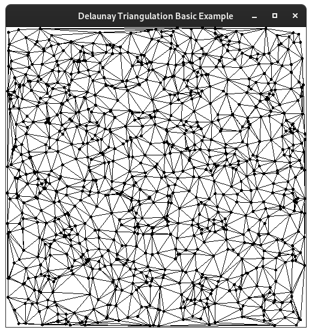
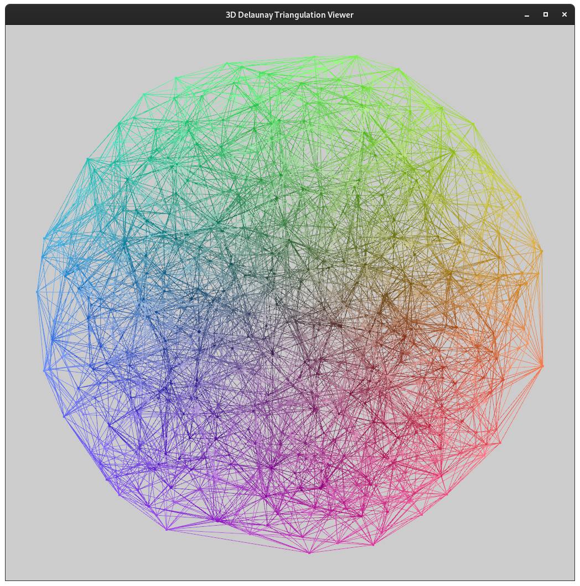
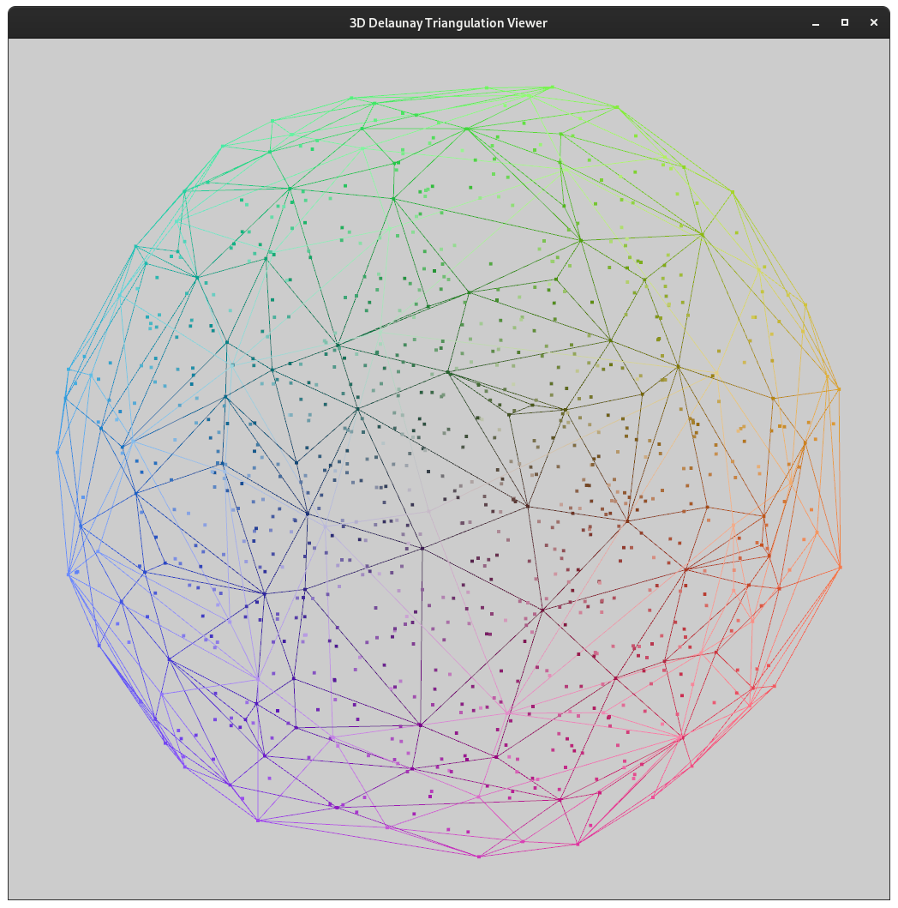

# Delaunay Triangulation

A simple implementation of the Bowyer-Watson algorithm to construct the Delaunay triangulation of a given set of points.
It was put into an easy-to-use C++ header-only library currently based on the [build2](https://build2.org/) build system.


<!-- [](https://lyrahgames.github.io/pxart) -->

<b>
<table>
    <tr>
        <td>
            master
        </td>
        <td>
            <a href="https://github.com/lyrahgames/delaunay">
                
            </a>
        </td>    
        <td>
            <!-- <a href="https://circleci.com/gh/lyrahgames/delaunay/tree/master"></a> -->
        </td>
        <td>
            <!-- <a href="https://codecov.io/gh/lyrahgames/delaunay">
              
            </a> -->
        </td>
    </tr>
    <tr>
        <td>
        </td>
    </tr>
    <tr>
        <td>
            Current
        </td>
        <td>
            <a href="https://github.com/lyrahgames/delaunay">
                
            </a>
        </td>
        <!-- <td>
            
        </td>
        <td>
            
        </td> -->
        <td>
            
        </td>
        <td>
            
        </td>
    </tr>
</table>
</b>

## Author
- Markus Pawellek (lyrahgames@mailbox.org)

## Requirements
- C++17
- [build2](https://build2.org/)

## Supported Platforms
- Operating System: Linux | Windows | MacOS
- Compiler: GCC | Clang | MSVC | MinGW
- Build System: [build2](https://build2.org/)

## Installation
The standard installation process will only install the header-only library.
If you are interested in installing examples, benchmarks, or tests, you have to run these installation commands manually.

    bpkg -d build2-packages cc \
      config.install.root=/usr/local \
      config.install.sudo=sudo

Get the latest package release and build it.

    bpkg build https://github.com/lyrahgames/delaunay.git

Install the built package.

    bpkg install lyrahgames-delaunay

For uninstalling, do the following.

    bpkg uninstall lyrahgames-delaunay

If your package uses an explicit `depends: lyrahgames-delaunay` make sure to initialize this dependency as a system dependency when creating a new configuration.

    bdep init -C @build cc config.cxx=g++ "config.cxx.coptions=-O3" -- "?sys:lyrahgames-delaunay/*"

## Usage with build2
For now, there is no official package release on `cppget.org`.
Therefore add this repository in your `repositories.manifest` file of your package.

    :
    role: prerequisite
    location: https://github.com/lyrahgames/delaunay#master

Add the following entry to the `manifest` file of your package with an optional version dependency.

    depends: lyrahgames-delaunay

Then import the library in your `buildfile` to be able to link against your own executable or library.

    import libs = lyrahgames-delaunay%lib{lyrahgames-delaunay}
    exe{myexe}: {hxx cxx}{**} $libs

## Examples

```c++
#include <random>
#include <vector>
//
#include <lyrahgames/delaunay/bowyer_watson.hpp>

int main() {
  using namespace std;
  using namespace lyrahgames;
  using delaunay::bowyer_watson::point;

  // Initialize oracle for random numbers.
  mt19937 rng{random_device{}()};
  uniform_real_distribution<float> dist{0, 1};
  const auto random = [&] { return dist(rng); };

  // Generate random points.
  vector<point> points(5);
  for (auto& p : points) p = point{random(), random()};

  // Construct Delaunay triangulation.
  const auto elements = delaunay::bowyer_watson::triangulation(points);
}
```



|3D Triangulation | Surface Triangles |
|---|---|
|  |  |

## Tests

## Benchmarks

## API

## Features

## Background
### Circumcircles and Circumspheres
### Bowyer-Watson Algorithm

## Implementation Details

## References

- [Lee and Schachter, *Two Algorithms for Constructing a Delaunay Triangulation*, 1980](http://www.personal.psu.edu/cxc11/AERSP560/DELAUNEY/13_Two_algorithms_Delauney.pdf)
- [Guibas and Stolfi, *Primitives for the Manipulation of General Subdivisions and the Computation of Voronoi Diagrams*, 1985](http://sccg.sk/~samuelcik/dgs/quad_edge.pdf)
- [Dwyer, *A Faster Divide-and-Conquer Algorithm for Constructing Delaunay Triangulations*, 1986](https://link.springer.com/article/10.1007/BF01840356)
- [Cignoni, Montani and Scopigno, *DeWall: A Fast Divide-and-Conquer Delaunay Triangulation Algorithm in E^d*, 1998](https://www.sciencedirect.com/science/article/abs/pii/S0010448597000821)
- [Fuetterling, Lojewski and Pfreundt, *High-Performance Delaunay Triangulation for Many-Core Computers*, 2014](https://diglib.eg.org/bitstream/handle/10.2312/hpg.20141098.097-104/097-104.pdf?sequence=1)
- [Slides to Fuetterling, Lojewski and Pfreundt, *High-Performance Delaunay Triangulation for Many-Core Computers*, 2014](https://www.highperformancegraphics.org/wp-content/uploads/2014/Fuetterling-Delaunay.pdf)
- [Shewchuk, *Triangle: Engineering a 2D Quality Mesh Generator and Delaunay Triangulator*](https://people.eecs.berkeley.edu/~jrs/papers/triangle.pdf)
- [Lischinski, *Incremental Delaunay Triangulation*, 1993](http://www.karlchenofhell.org/cppswp/lischinski.pdf)
- [Burnikel, *Delaunay Graphs by Divide and Conquer*, 1998](https://pure.mpg.de/rest/items/item_1819432_4/component/file_2599484/content)
- [Katajainen and Koppinen, *Constructing Delaunay Triangulations by Merging Buckets in Quadtree Order*, 1988](http://hjemmesider.diku.dk/~jyrki/Paper/KK88.pdf)
- [Watson, *Computing the N-Dimensional Delaunay Tessellation with Application to Voronoi Polytopes*, 1981](https://watermark.silverchair.com/240167.pdf?token=AQECAHi208BE49Ooan9kkhW_Ercy7Dm3ZL_9Cf3qfKAc485ysgAAAqYwggKiBgkqhkiG9w0BBwagggKTMIICjwIBADCCAogGCSqGSIb3DQEHATAeBglghkgBZQMEAS4wEQQMisD7nnrkJ2ySpDQ7AgEQgIICWfbh2MdeqM8eodZwMasPbS6dUMh3A1RxLnzBk2iWmphFgoLOj2unb4zXMsU46h7y2jgpEpmFQ_ijo7hdMNaqVMWnSPEzMjbIZA8eMxYFBH7BgkQfboM1BDximsYPY8N7LrBuKbEqNDQxxEtqKMk__h8nAMfUiYUCC94CL9RJzRzHchBp1Cb6YZfDXgHh9MvrHv_FmCH09fQldoMPn0B7sYz92ubK02AQ5Be-UGqkBC302Okna1lnrviMg01334Eotnn1nfwAc_8xNdpCCRkseF3V1ucmUloHtYQV6NrB-UzwoHZuVmZ4qwnw5ucC_nxYk8kC9XZ3_AiYri5uEw5VnZDsowUDPDQud-ReSPCRq0zCWUr60ulMaCutMRr9aMxNYQ3ZvsO7EAdOxIXI6P3ElWSx55z1eu-GCX9uchIY4Lf1xaeLNqpNqooWtte6U58u4c_HA85Ges-nwPkLmBwQn5Knj7P5dEJs2974Y9tZP_6jhiX1WxObN_ZS6ibui5I4vA2YfOcto4mrQgAE8tPTIjeJgzNETMw0zL7bonltX6fjS_nbLpmK_DdCMd4OYuw3bkZbU29h9bEQOb72UrTduSn_zZLVXdA21Z-FbGaPpPyt1vgb3fR2upms0lgvgqz6BLPmr4dpeX_dAxw5H2K9w21yKFCd6Q0DW2mX20TY25ZA2MCFJxU3yzLjJzdH2DLaApzPux8hqNNXP4J0KyQb75ihIIrCMmP4ICG4ZJWZ8IZ1hy6UV6lSMxoYRGcwZqjKq5tJiFCKkAR1qiTRZbR7E-ocMvKE_OzkHR8)
- [Bowyer, *Computing Dirichlet Tessellations*, 1981](https://watermark.silverchair.com/240162.pdf?token=AQECAHi208BE49Ooan9kkhW_Ercy7Dm3ZL_9Cf3qfKAc485ysgAAAqYwggKiBgkqhkiG9w0BBwagggKTMIICjwIBADCCAogGCSqGSIb3DQEHATAeBglghkgBZQMEAS4wEQQMID4hIrOUlhKhkWElAgEQgIICWZdoaI-U37S323EjksrDtfHAcuyUQO25rGZOFqhKi3fALzBeh-nqehbwGg_tWFQHrTjJTqRv6xrfSD4yN4SeTZAnUBq0K-v5IGIZo-evW6SKNtGESRB24HfbClLMRJDV868gT5Ri5LZ02FDPR6rJ4SZHIhcZiMP2POx8XmCUCoLx8IfZ4_9MXssLZqbaXu1BnMQrrLXIPb_TynBo-BkIhaxkkfaUpIDUA1KZrDiBIr1Cb5ZhYLDwH4QkJxE96_FhMK9ldoVQDL_psAAgE2bGmPTK_Vf8BLTawOnwxKvEdG7nZAg2V5SWt_3J7daIK5vAIxpfLRJSsAy-q5749U1yw2kofWro9DE_zt_rXeJnKEcB55alX2y7WnbAThF7roq4h0XjNCFccEAzEwJHr3N1VXnQvoOGIAvOlblnVYNQkPtjIgzjlCss00r8jn4XQQyj9yKbrF0HtbVsnmovZrRJpvR2HkTotsA6vtZcqWsQaPvP-74WDy4TVLITpKAx-G2_ne8Xb4VsjHqjFa3cBT_YUdJz2vq1PxEt56H8BfBZyd1tyswe0c9rrgX-W7RsOOt_gExNrZrXjvoV3PW7FgIv3Vnvxxa4rJDFC95pOXeABeeEL1Ic6akXlVoOZE5iyoUIfTfv32X-TMOTVBLlB-CSK-OTA72bJz67RIaj2EkdSi4j21_xEBNP0KclycQF-xz_Ly9QDzDYAEFDvUmzZvTOgjRKQPWLnuPG-M-a8rxXTOpgEZ1G7J1qPiyz9yftt6Cz51qadldqw4P4mIMh-fGmcN-LMHbP0OoxtoE)

- [CP-Algorithms, *Delaunay Triangulation and Voronoi Diagram*, 2014](https://cp-algorithms.com/geometry/delaunay.html)
- [*Quad Edge Data Structure*](https://www.neolithicsphere.com/geodesica/doc/quad_edge_overview.htm)
- [Shewchuk, *TRIANGLE: Mesh Generation and Delaunay Triangulation*](https://people.sc.fsu.edu/~jburkardt/c_src/triangle/triangle.html)
- [*Delaunay Triangulation in Two and Three Dimensions*](http://www.ae.metu.edu.tr/tuncer/ae546/prj/delaunay/)
- [Peterson, *Computing Constrained Delaunay Triangulations: In the Plane*](http://www.geom.uiuc.edu/~samuelp/del_project.html)
- [GitHub/Samson-Mano/Delaunay-triangulation](https://github.com/Samson-Mano/Delaunay-triangulation)
- [GitHub/rexdwyer/DelaunayTriangulation](https://github.com/rexdwyer/DelaunayTriangulation)
- [GitHub/Bathlamos/delaunay-triangulation](https://github.com/Bathlamos/delaunay-triangulation)
- [GitHub/eloraiby/delaunay](https://github.com/eloraiby/delaunay)
- [GitHub/bl4ckb0ne/delaunay-triangulation](https://github.com/bl4ckb0ne/delaunay-triangulation)
- [Wikipedia, *Delaunay Triangulation*](https://en.wikipedia.org/wiki/Delaunay_triangulation)
- [Wikipedia, *Bowyer-Watson Algorithm*](https://en.wikipedia.org/wiki/Bowyer%E2%80%93Watson_algorithm)